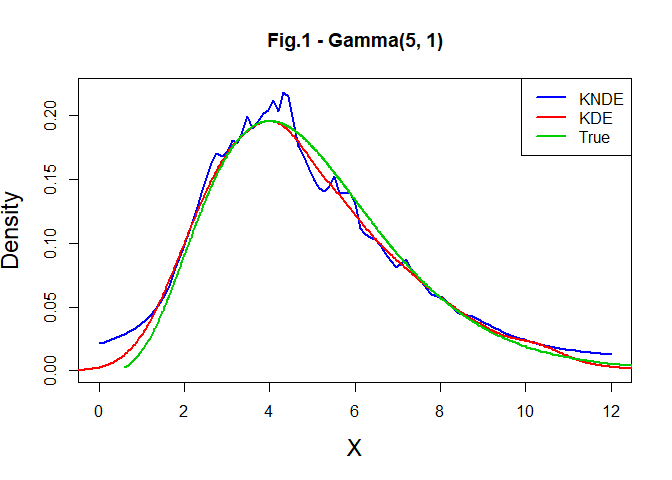
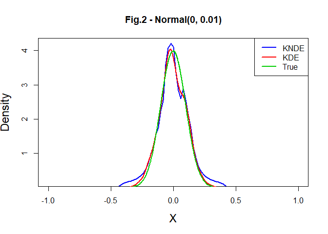
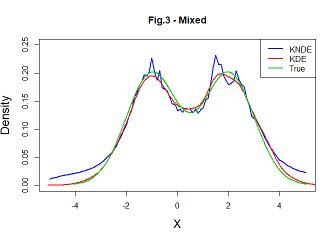

Main
================

``` r
set.seed(1)

library(logspline)
```

Section II

Generate data for one-shot experiment

``` r
x1 <- rgamma(1000,5,1)
x2 <- rexp(1000,2)

x3 <- numeric(1000)
for(i in seq_len(1000)) {
  z <- rbinom(1,1,0.5)
  if(z == 0) x3[i] <- rgamma(1,5,1)
  else x3[i] <- rexp(1,2)
}
```

Scenario 1 - Normal(0,1)

``` r
#LSE(blue)
plot.logspline(logspline(x1), 
               col='blue', lwd=2, 
               xlab="Data", 
               ylab="Density")

#KDE(red)
bw_1 = bw.bcv(x1)
kde_1 <- density(x1, bw=bw_1)
lines(kde_1, col='red', lwd=2)

#True density(green)
lines(sort(x1),dgamma(sort(x1),5,1), col=3, lwd=2)

#Plot configuration
legend(x="topright",
       legend=c("LSE", "KDE", "True"),
       col=c("blue", "red", 3), 
       lwd=2, cex=1)
```

<!-- -->

Scenario 2 - Beta(2,3)

``` r
#LSE(blue)
plot.logspline(logspline(x2), 
               col='blue', lwd=2, 
               xlab="Data", 
               ylab="Density")

#KDE(red)
bw_2 = bw.bcv(x2)
kde_2 <- density(x2, bw=bw_2)
lines(kde_2, col='red', lwd=2)

#True density(green)
lines(sort(x2),dexp(sort(x2),2), col=3, lwd=2)

#Plot configuration
legend(x="topright",
       legend=c("LSE", "KDE", "True"),
       col=c("blue", "red", 3), 
       lwd=2, cex=1)
```

<!-- -->

Scenario 3 - Mixed

``` r
#LSE(blue)
plot.logspline(logspline(x3), 
               col='blue', lwd=2, 
               xlab="Data", 
               ylab="Density")

#KDE(red)
bw_3 = bw.bcv(x3)
kde_3 <- density(x3, bw=bw_3)
lines(kde_3, col='red', lwd=2)

#True density(green)
mixed <- function(x) 0.5*dgamma(x,5,1) + 0.5*dexp(x,2)
lines(sort(x3),mixed(sort(x3)), col=3, lwd=2)

#Plot configuration
legend(x="topright",
       legend=c("LSE", "KDE", "True"),
       col=c("blue", "red", 3), 
       lwd=2, cex=1)
```

<!-- -->
